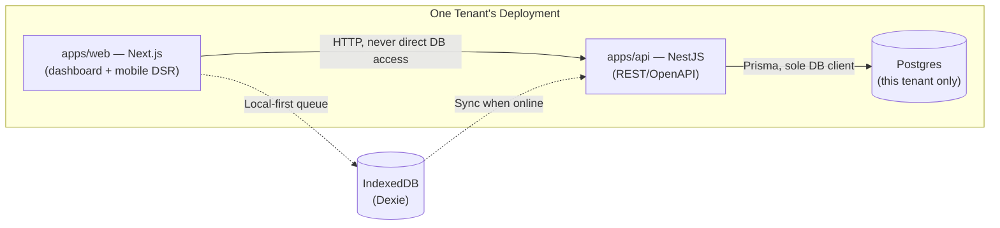
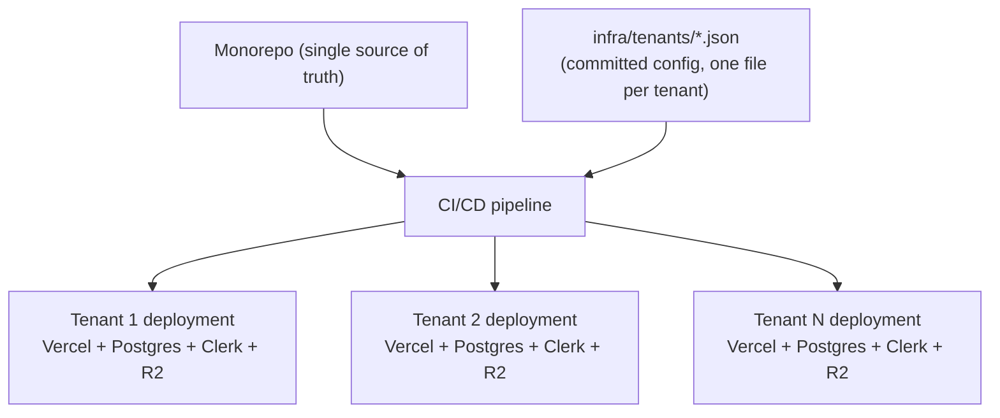
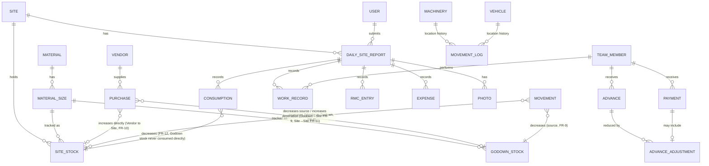

# Architecture Spine — AzentisFieldOS

## Design Paradigm

**Deploy-per-tenant (siloed) SaaS on a PaaS substrate.** There is no shared database and no in-app tenant switching. Each contractor client is a fully independent deployment: its own frontend, its own backend, its own database, provisioned from one codebase. Multi-tenancy is a *deployment-time* concern, not a *runtime* one — "which tenant" is never a value the running code branches on, because a running instance only ever serves one.

Three layers, one dependency direction:



`apps/web` and `apps/api` map to the paradigm's two layers; `packages/*` (below) are shared code, not a third runtime layer — they compile into both apps, they don't run independently.

## Invariants & Rules

### AD-1 — Isolation by deployment, not by query [ADOPTED]

- **Binds:** NFR-1, FR-52, FR-53 — all data
- **Prevents:** the entire class of cross-tenant data leak bugs (missing `WHERE tenant_id = ?`, a forgotten RLS policy, an admin query that "just this once" skips scoping) — the failure mode the PRD's adversarial review flagged as the highest-consequence risk in the product.
- **Rule:** No table, model, query, or API route may reference a "current tenant" selector. There is exactly one tenant per running deployment, fixed at deploy time via environment configuration (`TENANT_ID`, branding, etc.). No `tenant_id` column exists anywhere in the schema. A pull request introducing tenant-scoping logic is solving a problem this architecture doesn't have — reject it, don't merge it.

### AD-2 — Onboarding is a script, not a workflow

- **Binds:** FR-52 (reinterpreted — see PRD reconciliation note in Deferred)
- **Prevents:** a new tenant's environment being hand-configured inconsistently — a missed env var, a forgotten branding asset, a DB migration skipped once and never noticed.
- **Rule:** provisioning a new tenant runs entirely from `infra/provisioning/`, as one script covering every per-tenant resource the topology requires — not a subset: create the Vercel project, create the Neon Postgres instance (plus its paired staging branch, AD-12), create the Clerk instance/config, create the R2 bucket, apply that tenant's config file (one file per tenant under `infra/tenants/`, named after the tenant's slug — branding, domain, contact), run migrations, deploy. The config file is the only per-tenant state that isn't code; it's committed to the monorepo, versioned, and diffable. No tenant resource — Vercel, database, auth, or storage — is provisioned by clicking through a cloud console by hand; if the script doesn't create it, it isn't part of the standard tenant shape.

### AD-3 — The API is the only database client

- **Binds:** all data access
- **Prevents:** business logic or validation duplicating or diverging between a Next.js server action and the NestJS API — two places that can each be "almost right" differently.
- **Rule:** `PrismaClient` is instantiated only inside `apps/api`. `apps/web` reaches data exclusively over HTTP (REST/OpenAPI), including during server-side rendering. No direct database import ever appears under `apps/web`.

### AD-4 — One design-token source, zero inline styles

- **Binds:** all UI (`packages/ui`, `apps/web`)
- **Prevents:** the "generic/template-like" drift the founder explicitly ruled out, and the slow accumulation of one-off spacing/color values that makes a design system stop being one.
- **Rule:** every color, type scale, spacing step, radius, shadow, breakpoint, and z-index value is defined exactly once, in `packages/ui`'s Tailwind v4 CSS-first theme (`@theme` block) — never as a literal in component code. A raw hex, px, or rgba value inside `apps/web` outside that file is a defect, not a style choice.

### AD-5 — One implementation per UI primitive

- **Binds:** all UI
- **Prevents:** two screens each building their own modal, table, or toast because reaching for the shared one felt slower in the moment.
- **Rule:** buttons, inputs, forms, modals, dialogs, tables, cards, toasts, loaders, and alerts each have exactly one implementation, living in `packages/ui` as shadcn-pattern components (copied in, not pulled from a runtime UI-kit dependency). `apps/web` imports and composes; it never re-implements. A new visual variant extends the shared component's documented prop surface — it doesn't fork the component.

### AD-6 — Every data-bearing screen carries its full state set

- **Binds:** all screens that fetch or mutate server data
- **Prevents:** the "unfinished state" the founder's own standards explicitly forbid — a screen that renders correctly on the happy path and does something undefined the first time a request is slow, empty, or fails.
- **Rule:** any component fetching or mutating server data renders one of `packages/ui`'s shared state components — loading, empty, success, error, or (for forms) validation-failure — never ad-hoc per-screen conditionals for these states.

### AD-7 — One validation schema per data shape, shared front and back

- **Binds:** all forms and all API input boundaries
- **Prevents:** the Purchase form and the API's Purchase endpoint independently hand-rolling "close enough" validation that drifts the first time one of them changes.
- **Rule:** every input shape (Purchase, Advance Adjustment, DSR, etc.) has exactly one Zod schema, defined once in `packages/shared`, imported by both `apps/api` (server-side enforcement, the actual source of truth) and `apps/web` (client-side, same schema, for instant feedback). Never two independently authored validators for the same field set.

### AD-8 — DSR entry is local-first; the network is an optimization, not a dependency

- **Binds:** FR-28, FR-29, NFR-3
- **Prevents:** the data loss / silent duplication that naive "retry the POST when offline" handling produces — identified explicitly in the PRD's edge-case review.
- **Rule:** a DSR and its linked sub-records (Consumption, Work Record, Expense, RMC entry, photos) are written to a local Dexie/IndexedDB queue first, unconditionally, online or offline. **The idempotency key is per sub-record, not per DSR** — a DSR is a compound object assembled from many independently-syncing pieces, each queued and synced as its own unit with its own client-generated key; the API upserts on that key, so a retried sync can never create a duplicate. This also resolves the two-device/double-edit conflict case: because each sub-record syncs independently, "conflict" only exists at the sub-record level, and the rule there is last-synced-write-wins per sub-record, never a whole-DSR overwrite.

### AD-9 — Financial and stock transactions are append-only

- **Binds:** FR-54, FR-8 through FR-14, FR-22 through FR-25
- **Prevents:** silent overwrites of money- or material-moving state, and "current value" fields drifting from the history that supposedly produced them.
- **Rule:** rows in transaction-history tables (Purchase, Movement, Consumption, Advance, AdvanceAdjustment, Payment) are immutable after creation — no `UPDATE`, no `DELETE`, from application code. A correction is a new row, linked to the one it corrects, carrying a required reason field. This is enforced at the database layer, not just by convention: the API's Postgres role has no `UPDATE`/`DELETE` grant on these tables (Prisma migrations run under a separate, more-privileged role) — a bug in application code cannot silently violate this. Current-state values (GodownStock, SiteStock, Outstanding Balance) are **materialized, write-path-only** columns: the *only* code path allowed to change one is the same database transaction that inserts the ledger row causing the change (e.g. recording a Consumption both inserts the Consumption row and decrements SiteStock, atomically, in one transaction). No other code path — no report, no admin action, no migration script — ever writes to a Stock or Balance column directly. This is stronger than "computed on every read" (which would be too slow at scale) while keeping the same guarantee: a Stock/Balance value can never drift from the ledger that produced it, because nothing else is allowed to touch it.

### AD-10 — Identity and MFA belong to Clerk, not to this codebase

- **Binds:** all authentication, NFR-8
- **Prevents:** hand-rolled password hashing, session handling, or MFA — the exact category of risk the PRD's adversarial review raised against a cross-tenant-capable admin role.
- **Rule:** no application code implements password storage, session issuance, or MFA. Clerk owns identity; `apps/api` validates a Clerk-issued session token on every request via middleware, and nowhere else.

### AD-11 — "Platform Operator" is a credential holder, not an application role

- **Binds:** FR-52 (reinterpreted), NFR-8
- **Prevents:** two builders each inventing a different in-app "admin who can see every tenant" surface — which AD-1 explicitly forbids any running deployment from having.
- **Rule:** there is no in-app Platform Operator role, screen, or API endpoint anywhere in `apps/web` or `apps/api` — AD-1 makes that structurally impossible, since no deployment ever knows another tenant exists. "Tenant provisioning" (FR-52) is entirely the capability of whoever holds credentials to `infra/provisioning` and the underlying Vercel/Neon/Clerk/Cloudflare accounts. NFR-8's MFA requirement binds to *those* credentials: every account with provisioning access (Vercel team account, Neon org, Clerk, Cloudflare, and the CI/CD identity that runs `infra/provisioning`) requires MFA, and access is limited to named individuals, not a shared login — enforced at the provider level, not in this codebase.

### AD-12 — Every migration lands on staging before it lands on a tenant's production data

- **Binds:** all schema migrations, FR-52/AD-2 provisioning
- **Prevents:** a migration going straight from a developer's machine to the paying pilot's production database with no dry run.
- **Rule:** every tenant deployment is provisioned with a paired staging environment: a Neon branch (instant, cheap, schema-identical copy) plus a Vercel preview deployment pointed at it. The release pipeline applies a migration to every tenant's staging branch first; only after that step succeeds does the same migration apply to the corresponding production branch. A migration that fails on any tenant's staging halts the release for that tenant without blocking others (deploy-per-tenant means one tenant's failure is isolated by construction — a property of AD-1, not an extra mechanism).

### AD-13 — Background work runs as scheduled functions, not a separate worker service

- **Binds:** FR-32/FR-33 (report generation/delivery), AD-8 sync
- **Prevents:** two builders disagreeing on whether "end of day" work needs a standing worker process (which Vercel's serverless model doesn't provide) or can live inside the same deployment.
- **Rule:** the daily report generation/delivery job (FR-32/FR-33) runs as a Vercel Cron-triggered API route inside `apps/api` — no separate long-running worker service exists in this architecture. Offline DSR sync (AD-8) is client-triggered, not server-scheduled, so it needs no background-job infrastructure of its own.

### AD-14 — Observability and backup posture is identical across every tenant deployment

- **Binds:** all deployments (operational envelope)
- **Prevents:** tenant deployments silently drifting in how well they're monitored or backed up, since there's no shared infrastructure layer to enforce this centrally the way a single multi-tenant app would.
- **Rule:** every tenant deployment ships with the same baseline, applied by the provisioning script (AD-2), not configured ad hoc per tenant: Sentry for error tracking, Vercel's built-in request/function logs and analytics, and Neon's automatic backups with point-in-time recovery (no custom backup tooling built by this project). One tenant's incident (a bad deploy, a database issue) is isolated to that tenant's infrastructure by construction and cannot cascade to another tenant — a direct benefit of AD-1's isolation model, worth naming explicitly since it's the honest trade for giving up a shared HA layer. Formal uptime SLA, on-call rotation, and alerting policy are Deferred — reasonable for current scale, revisit as tenant count grows.

### AD-15 — Accessibility and performance budgets are enforced in CI, not left to review

- **Binds:** all of `apps/web` (WCAG AA, Lighthouse >95 constraints)
- **Prevents:** the founder's binding accessibility/performance standards degrading silently as screens accumulate, discovered only late via manual spot-checks.
- **Rule:** every PR touching `apps/web` runs `eslint-plugin-jsx-a11y` (lint-time) and Lighthouse CI (build-time, budgets set to the founder's >95 targets across Performance/Accessibility/Best Practices/SEO) in the CI workflow; a regression below budget fails the build. This doesn't guarantee the "premium, non-generic" visual-quality bar (that's a design/review judgment, not something CI can check) — but it makes the *measurable* half of the standard (WCAG AA, Lighthouse) a gate, not a hope.

## Consistency Conventions

| Concern | Convention |
| --- | --- |
| Naming (entities, files, routes) | Prisma models in PascalCase, matching PRD Glossary terms verbatim (`Site`, `Material`, `TeamMember`, `Advance`, …) — no `Tenant` model (see AD-1). Fields/variables in camelCase. Files in kebab-case. REST resources are plural nouns matching the Glossary (`/sites`, `/work-records`, `/advance-adjustments`), never a synonym. |
| Data & formats | IDs: UUID v7 (time-sortable, index-friendly). Timestamps: stored UTC ISO-8601, rendered in the deployment's configured local timezone. Money: integer minor units (paise) — never a float. Errors: one JSON envelope, `{ error: { code, message, details? } }`, emitted by a single global NestJS exception filter — no endpoint invents its own error shape. Custom Fields (PRD FR-7): configurable entities (Material, Machinery, Vehicle) carry a `customFields JSONB` column instead of a per-tenant schema variant — an admin adding a custom field is a data change, not a migration, keeping every tenant's schema identical (required by AD-2's scripted, non-branching provisioning). |
| State & cross-cutting | All writes go through `apps/api` (AD-3). Config is environment variables only, validated at process boot against a Zod schema — a missing or malformed variable fails startup loudly, never silently defaults. Logging is structured JSON (pino), carrying a request id that ties a frontend action to its backend log line. Auth is a Clerk session token validated per-request (AD-10); the `User.role` field (in-app Role, §3 PRD Glossary — Owner/Admin or Site Supervisor only, per AD-11) lives in Postgres, set by an Owner/Admin via the Admin Configuration screens, and is read on every request to authorize the action — Clerk owns *identity*, this schema owns *role*. |

## Stack

| Name | Version |
| --- | --- |
| Next.js (App Router) | 16.3.0 |
| React | 19.2.8 |
| NestJS | 11.1.28 |
| Prisma | 7.9.1 |
| PostgreSQL (managed, one instance per tenant) | Neon, current default major at provisioning time (18 as of this writing) |
| Tailwind CSS | 4.3.3 (CSS-first `@theme`, no JS config file) |
| shadcn/ui (component pattern; Base UI primitives underneath, not Radix) | current (July 2026 Base UI migration) |
| Clerk (`@clerk/nextjs`) | 7.7.0 — requires Next.js 16.0.10+ (skip 16.0.0–16.0.9) |
| Turborepo | 2.10.9 |
| pnpm | latest stable, pinned via `packageManager` in root `package.json` |
| Dexie.js | 4.4.4 |
| Zod | 4.4.3 |
| Vitest | 4.1.10 |
| Playwright | 1.62.1 |
| Cloudflare R2 (object storage — DSR photos, documents) | current API |
| Resend (transactional email — FR-33/FR-50 email channel) | current API |
| Vercel Cron (scheduled jobs — daily report generation, AD-11) | current (Vercel platform feature, no separate worker service) |
| Sentry (error tracking, AD-11) | current SDK |
| Hosting | Vercel (per-tenant project) |
| WhatsApp delivery | via BSP (Gupshup or Interakt), not direct Meta Cloud API |

## Structural Seed

```text
azentisfieldos/
  apps/
    web/                 # Next.js 16 App Router — owner dashboard + mobile-first DSR surface
    api/                 # NestJS — REST/OpenAPI; sole Prisma client (AD-3)
  packages/
    ui/                  # shadcn-pattern components + Tailwind v4 design tokens (AD-4, AD-5)
    shared/               # Zod schemas (AD-7), shared TS types/enums, constants
    config/               # shared ESLint / TypeScript / Tailwind preset configs
  infra/
    provisioning/         # scripted tenant onboarding: Vercel project + DB + config + deploy (AD-2)
    tenants/               # one committed config file per tenant (branding, domain, contact) — AD-2
    prisma/                # schema.prisma + migrations (identical schema, run per tenant deployment)
  .github/
    workflows/             # CI: lint/typecheck/test per PR. CD: deploy pipeline, one run per tenant on release.
```

Deployment topology — one codebase, N independent environments:



Core entities (names + relationships only — attributes that are themselves invariants are ADs above, not this diagram):



## Capability → Architecture Map

| PRD Feature | Lives in | Governed by |
| --- | --- | --- |
| §4.1 Multi-Site Management | `apps/web` (dashboard), `apps/api` (Site resource) | AD-3, Consistency Conventions |
| §4.2 Material Catalog Configuration | `apps/api` (Material/Category/Size/Unit resources) | AD-3, AD-7 |
| §4.3 Inventory Lifecycle & Movement | `apps/api` (Purchase/Movement/Consumption resources) | AD-3, AD-9 |
| §4.4 Machinery & Vehicle Registers | `apps/api` | AD-9 (movement history) |
| §4.5 Labour & Team Management | `apps/api`, `apps/web` (DSR entry) | AD-7 |
| §4.6 Labour Advances & Payments | `apps/api` | AD-9 |
| §4.7 RMC Tracking | `apps/api` | AD-3 |
| §4.8 Daily Site Report | `apps/web` (Dexie-backed offline form), `apps/api` | AD-8, AD-6, AD-7 |
| §4.9 Automated Report Generation & Delivery | `apps/api` (Cron-triggered route), WhatsApp BSP + Resend integrations | AD-13, Deferred (BSP contract) |
| §4.10 Contractor Dashboard | `apps/web` | AD-6 |
| §4.11 Vendor Management | `apps/api` | AD-3 |
| §4.12 Expense Tracking | `apps/api`, DSR (§4.8) | AD-7 |
| §4.13 Reports | `apps/api` (query endpoints), `apps/web` | AD-3 |
| §4.14 Admin Configuration | `apps/web` (settings UI), `apps/api` | AD-4, AD-7 |
| §4.15 Multi-Tenant / White-Label Platform | `infra/provisioning`, `infra/tenants` | AD-1, AD-2, AD-11, AD-12, AD-14 |
| §4.16 Audit & Transaction History | `apps/api` (all write paths) | AD-9 |

## Deferred

- **WhatsApp BSP contract selection (Gupshup vs Interakt vs AiSensy)** — a vendor/pricing decision, not an architectural one; doesn't change AD-9's shape. Resolve when FR-33 is implemented (PRD Open Question 3).
- **Photo compression strategy** (client-side, before upload to R2) — needed to make AD-8 practical over 2G/3G (PRD NFR-2, Open Question 13), but the specific compression library/target is an implementation detail, not an invariant.
- **CI/CD fan-out mechanics** (exactly how one release triggers N tenant deployments — GitHub Actions matrix over `infra/tenants/*.json`, or a dedicated release tool) — AD-2 fixes that provisioning is scripted; the specific orchestration tool is free to choose at implementation time.
- **Billing/cost consolidation across N Vercel + N Postgres + N R2 accounts** — an operational/finance concern for the founder, not a code-level invariant. Worth naming explicitly: deploy-per-tenant means infrastructure cost is **linear per tenant** (each new contractor adds a full Vercel+Neon+R2+Clerk+Sentry bill), not the shared marginal cost a pooled multi-tenant app would have. This should feed directly into the still-unresolved pricing model (PRD Open Question 2) rather than being decided independently of it.
- **Government-audit-grade export format** (PRD Open Question 4) — deferred entirely pending the founder's confirmation of whether it's in scope; AD-9's append-only model is compatible with adding this later without restructuring.
- **Regional-language (Hindi/other) UI** (PRD Open Question 7) — an i18n layer choice (e.g. `next-intl`), deferred until the requirement is confirmed; nothing in this spine blocks adding it later.
- **PRD FR-52/FR-53 wording reconciliation** — these requirements were authored assuming a shared app with an in-app Platform Operator role; AD-1, AD-2, and AD-11 now fully resolve *what actually satisfies them* (scripted provisioning, credential-level MFA, no in-app cross-tenant surface). What remains is purely editorial: the PRD's own FR/NFR text should be updated to describe this so a future reader doesn't expect a Platform Operator screen that will never exist — offered at Finalize, not resolved here.
- **Formal uptime SLA, on-call rotation, and alerting policy** (AD-14) — reasonable to run without one at current scale (a handful of tenants, one founder); revisit once tenant count or contract terms demand a committed number.
- **NFR-2's mobile/network performance target** — still open per PRD Open Question 13 (photo-heavy DSRs vs. a 2G/3G baseline); this spine names the offline mechanism (AD-8, Dexie/IndexedDB) but not a specific measured target, which stays a PRD-level decision.
